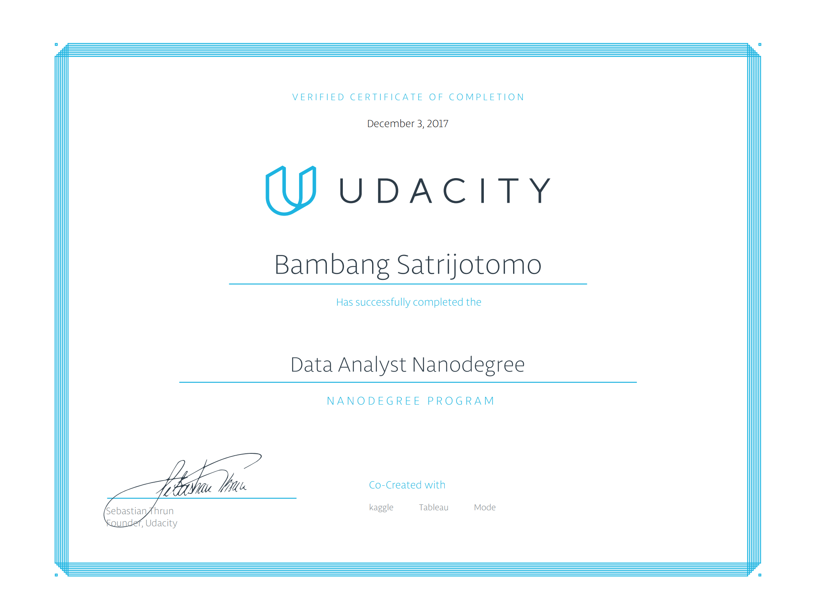

# Udacity Data Analyst Nano Degree
This is the repository for my projects for Udacity Data Analysis Nano Degree.

## [Project 0: ](https://github.com/satrijotomo/Udacity-DAND/blob/master/Project_0/Bay_Area_Bike_Share_Analysis.ipynb)
This project introduced me to the key steps of the data analysis process by reviewing Bike Ride data. The code is in Python 2.7 in  a Jupyter notebook.

## [Project 1: ](http://htmlpreview.github.io/?https://github.com/satrijotomo/Udacity-DAND/blob/master/Project_1/Project%2BStroop.html)
Analyze data to apply the correct statistical test to examine the difference between two samples. A classic phenomenon from experimental psychology called the Stroop Effect is investigated in this project. A hypothesis is set and tested, and conclusions are drawn based on the results.

## [Project 2: ](https://github.com/satrijotomo/Udacity-DAND/blob/master/Project_2/Titanic%20Survival.ipynb)
In this project, I analyze Titanic survival data to uncover correlation and pattern. I use the Python libraries NumPy, Pandas, and Matplotlib to make my analysis and to communicate my findings. 

## [Project 3: ](https://github.com/satrijotomo/Udacity-DAND/blob/master/Project_3/P3_OpenstreetMap_BambangSatrijotomo.ipynb)
OSM map (XML) data cleaning, munging and processing by using Python. The output is the CSV files which then loaded into SQL database tables. Subsequent analysis is performed with SQL queries to make sense of the data.

## [Project 4: ](https://github.com/satrijotomo/Udacity-DAND/blob/master/Project_4/ProsperLoan-BambangSatrijotomo.rmd)
Exploratory Data Analysis on Prosper Loan dataset using R. Univariate, bivariate and multivariate analysis is performed on the dataset using various R libraries in R Studio (rmd format).

## [Project 5: ](https://github.com/satrijotomo/Udacity-DAND/tree/master/Project_5)
Identify Fraud from Enron Email. In 2000, Enron was one of the largest companies in the United States. By 2002, it had collapsed into bankruptcy due to widespread corporate fraud. In the resulting Federal investigation, a significant amount of typically confidential information entered into the public record, including tens of thousands of emails and detailed financial data for top executives. In this project, I build a person of interest identifier based on financial and email data made public as a result of the Enron scandal. Several supervised machine learning algorithms are used to find the best performance which subsequently then tuned to increase the performance.

## [Project 6: ](http://htmlpreview.github.io/?https://github.com/satrijotomo/Udacity-DAND/blob/master/Project_6/Project6Baseball5.html)
In this project I created an interactive and animated visualization to show a number of summary statistics based on the individual baseball players. The animated charts would give readers insights into the correlation between the player's height, handedness and home run. I chose Dimple JS with the storyboard to build the visualization based on its efficient way of creating the animated and interactive chart.

## Certificate

